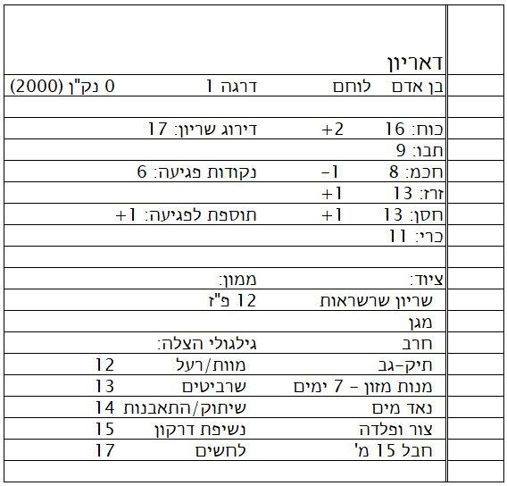

# דמויות שחקן

# כיצד ליצור דמות שחקן

ראשית, תזדקקו לדף נייר שעליו תרשמו את נתוני הדמות. אפשר להשתמש בגליון דמות מודפס מראש אם יש כזה, או פשוט בדף ממחברת. דוגמה לדמות מוצגת להלן. מומלץ להשתמש בעיפרון כדי לרשום את כל המידע, שכן כל נתון עשוי להשתנות במהלך המשחק.

גלגלו 3d6 עבור כל ערך תכונה, כפי שמתואר בסעיף [תכונות הדמות](abilities.qmd#ability-scores), ורשמו את התוצאות לאחר שמות התכונות. רשמו את הערכים לפי הסדר שבו גלגלתם אותם; אם אינכם מרוצים מהערכים שגלגלתם, בקשו עצה מהמנחה, שכן היא עשויה לאפשר צורה כלשהי של חלוקת נקודות או החלפת ערכים.

רשמו ליד כל ערך תכונה את הבונוס (או הקנס) המתאים לו, כפי שמוצג בטבלה שבעמוד הבא.

בחרו גזע ומקצוע לדמותכם. על הדמות לעמוד במינימום הדרישה העיקרית של המקצוע, כפי שמתואר בסעיף [מקצועות הדמות](class.qmd#character-classes), כדי להשתייך למקצוע זה. שימו לב גם שיש דרישות מינימום (ומקסימום) של תכונות עבור הגזעים השונים, שיש לעמוד בהן, כפי שמתואר בסעיף [גזעי הדמות](races.qmd#character-races).

{#fig-char-info}

רשמו את היכולות המיוחדות של בחירות הגזע והמקצוע שלכם, כפי שמתואר להלן. אם בחרתם לשחק קוסם, שאלו את המנחה אילו לחש או לחשים הדמות שלכם יודעת; ההחלטה נתונה למנחה, אך היא עשויה לאפשר לכם לבחור לחש אחד או יותר בעצמכם.

ציינו בגליון הדמות שלדמותכם יש אפס (0) נקודות ניסיון (או נק"נ); ייתכן שתרצו גם לציין את המספר הדרוש כדי להתקדם לדרגה שנייה, כפי שמופיע בטבלה של המקצוע שלכם.

גלגלו את קוביית הפגיעה המתאימה למקצוע שלכם, הוסיפו את בונוס או קנס החוסן שלכם, ורשמו את התוצאה כנקודות הפגיעה שלכם בגליון הדמות. שימו לב שאם לדמות יש קנס חוסן, הקנס לא יוריד שום גלגול של קוביית פגיעה מתחת ל-1 (כך שאם לדמות יש קנס חוסן של -2, ואתם מגלגלים 2, הסכום מותאם ל-1).

גלגלו עבור הכסף ההתחלתי שלכם. בדרך כלל הדמות תתחיל עם 3d6 כפול 10 מטבעות זהב, אך שאלו את המנחה לפני הגלגול.

כעת רכשו ציוד עבור דמותכם, כפי שמוצג בסעיף [ציוד](equipment.qmd). רשמו את הרכישות בגליון הדמות, וציינו כמה כסף נשאר לאחר מכן. ודאו שאתם מבינים את מגבלות הנשק והשריון של המקצוע והגזע שלכם לפני ביצוע הרכישות.

מאחר שכעת אתם יודעים איזה סוג שריון הדמות לובשת, עליכם לציין את דירוג השריון שלכם בגליון הדמות. אל תשכחו להוסיף לערך את בונוס או קנס הזריזות שלכם.

מצאו את בונוס התקיפה של הדמות (ראו @tbl-attacking-bonus בתוך [מפגשים](combat.qmd)) ורשמו אותו בגליון הדמות. אל תוסיפו לערך זה את בונוסי התכונות (או הקנסות), שכן תוסיפו בונוס אחר (כוח או זריזות) בהתאם לסוג הנשק שבו תשתמשו בקרב (כלומר, קרב פנים אל פנים או נשק קליעים).

כמו כן, מצאו את גלגולי ההצלה שלכם (מהטבלאות שליד סוף סעיף [מפגש](combat.qmd#saving-throw-tables-by-class) או בסעיף [מקצוע](class.qmd#character-classes) המתאים) ורשמו אותם בגליון הדמות. התאימו את ערכי גלגולי ההצלה בהתאם לגזע שלכם, אם הדמות היא דמוי-אדם (ראו [גזעי הדמות](races.qmd)). *שימו לב* שבונוסי גלגול ההצלה לדמויי-אדם מוצגים כערכי "פלוס", שיש להוסיף לגלגול הקובייה; לנוחותכם, תוכלו פשוט להחסיר אותם ממספרי גלגולי ההצלה בגליון הדמות במקום זאת.

לבסוף, אם עדיין לא עשיתם זאת, תנו שם לדמותכם. לעיתים קרובות זה לוקח יותר זמן מכל שאר השלבים יחד.

