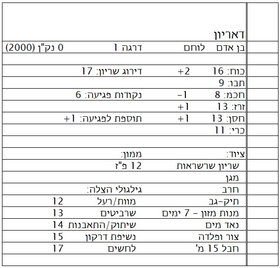

# דמויות שחקן

# כיצד ליצור דמות שחקן

ראשית, תזדקק לדף נייר שעליו תרשום את נתוני הדמות. אפשר להשתמש בגיליון דמות מודפס מראש אם יש ברשותך, או פשוט בדף ממחברת. דוגמה לדמות מוצגת להלן. מומלץ לכתוב בעיפרון, שכן כל נתון עשוי להשתנות במהלך המשחק.

גלגל 3d6 עבור כל ערך תכונה, כפי שמתואר בסעיף [תכונות הדמות](abilities.qmd#ערכי-תכונות), ורשום את התוצאות לאחר שמות התכונות. רשום את הערכים לפי הסדר שבו גלגלת אותם. אם אינך מרוצה מהערכים שגלגלת, בקש עצה מהמנחה, שכן היא עשויה לאפשר צורה כלשהי של החלפת נקודות או ערכים.

רשום ליד כל ערך תכונה את התוסף או המחסר המתאים לו, כפי שמוצג בטבלה שבעמוד הבא.

בחר גזע ומקצוע לדמותך. כדי להשתייך למקצוע, על הדמות לעמוד בערך המינימלי של הדרישה העיקרית שלו, כמתואר בסעיף [מקצועות הדמות](class.qmd#character-classes). כמו כן, שים לב שיש לעמוד בדרישות מינימום ומקסימום של תכונות עבור הגזעים השונים, כפי שמתואר בסעיף [גזעי הדמות](races.qmd#character-races).

{#fig-char-info}

רשום את היכולות המיוחדות של הגזע והמקצוע שבחרת, כפי שמתואר להלן. אם בחרת לשחק קוסם, שאל את המנחה איזה לחש או אילו לחשים הדמות שלך יודעת. ההחלטה בידי המנחה, אך היא עשויה לאפשר לך לבחור לחש אחד או יותר בעצמך.

ציין בגיליון הדמות שלדמותך יש אפס (0) נקודות ניסיון (או נק"נ). ייתכן שתרצה גם לציין את המספר הדרוש כדי להתקדם לדרגה שנייה, כפי שמופיע בטבלה של המקצוע שלך.

גלגל את קוביית הפגיעה המתאימה למקצוע שלך, הוסף את תוסף החוסן או מחסר החוסן שלך, ורשום את התוצאה כנקודות הפגיעה שלך בגיליון הדמות. שים לב שאם לדמותך יש מחסר חוסן, הוא לא יוריד תוצאה של גלגול קוביית פגיעה מתחת ל-1. לדוגמה, אם לדמותך יש מחסר חוסן של -2 וגלגלת 2, התוצאה מותאמת ל-1.

גלגל לקביעת סכום הכסף ההתחלתי שלך. בדרך כלל הדמות תתחיל עם 3d6 כפול 10 מטבעות זהב, אך שאל את המנחה לפני הגלגול.

כעת רכוש ציוד עבור דמותך, כפי שמוצג בסעיף [ציוד](equipment.qmd). רשום את הרכישות בגיליון הדמות, וציין כמה כסף נשאר לאחר מכן. ודא שאתה מבין את מגבלות הנשק והשריון של המקצוע והגזע שלך לפני הרכישות.

מאחר שכעת אתה יודע איזה סוג שריון הדמות לובשת, עליך לציין את דירוג השריון שלך בגיליון הדמות. אל תשכח להוסיף לערך את התוסף או המחסר של הזריזות שלך.

מצא את תוסף ההתקפה של הדמות (ראו @tbl-attacking-bonus בתוך [מפגשי קרב](combat.qmd)) ורשום אותו בגיליון הדמות. אל תוסיף לערך זה את התוספים או המחסרים של התכונות, שכן תוסיף תוסף אחר (כוח או זריזות) בהתאם לסוג הנשק שבו תשתמש בקרב (כלומר, נשק לקרב פנים אל פנים או נשק קליעים).

כמו כן, מצא את גלגולי ההצלה שלך (מהטבלאות לקראת סוף פרק [מפגשי קרב](combat.qmd#טבלאות-גלגולי-הצלה-לפי-מקצוע) או בפרק ה[מקצוע](class.qmd#character-classes) המתאים) ורשום אותם בגיליון הדמות. התאם את ערכי גלגולי ההצלה בהתאם לגזע שלך, אם הדמות היא דמוי-אדם (ראו [גזעי הדמות](races.qmd)). *שים לב* שתוספי גלגול ההצלה לדמויי-אדם מוצגים כערכי "פלוס", שיש להוסיף לגלגול הקובייה; לנוחותך, תוכל פשוט להחסיר אותם ממספרי גלגולי ההצלה בגיליון הדמות במקום זאת.

לבסוף, אם עדיין לא עשית זאת, תן שם לדמותך. לעיתים קרובות זה לוקח יותר זמן מכל שאר השלבים יחד.